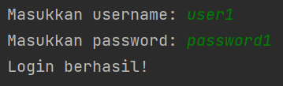
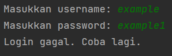

# UAS - PENGOLAHAN CITRA
```
Dosen Pengampu   : Ahmad Turmudi Zy, S.Kom., M.Kom
Mata Kuliah      : Kriptografi
Nama             : Ikram Ramadhan
Nim              : 312110478
Kelas            : TI.21.C.1
```
#### ini adalah program login sederhana dan vigenere chipper menggunakan bahasa python.
     
**Berikut penjelasan dari setiap bagian source code tersebut :**  
```
**Import Library :**

- import random untuk menghasilkan angka acak yang berfungsi sebagai token atau verifikasi tambahan. 

**Fungsi**

1. Enkripsi Password dengan Vigenere Cipher:

Program menggunakan fungsi vigenere_encrypt(plain_text, key) untuk mengenkripsi kata sandi yang dimasukkan oleh pengguna menggunakan algoritma Vigenere Cipher. Kata sandi dienkripsi dengan menggunakan kata kunci yang telah ditentukan (dalam contoh ini, kata kunci adalah "rahasia").
Hasil enkripsi kata sandi akan disimpan dalam database bersama dengan username.

2. Fungsi generate_random_token():

Fungsi ini digunakan untuk menghasilkan token acak yang akan digunakan sebagai tambahan verifikasi saat login.
Token acak dihasilkan dengan memilih karakter acak dari himpunan karakter huruf besar, huruf kecil, dan angka.

3.Sistem Login:

Pengguna diminta untuk memasukkan username dan password saat menjalankan program.
Program akan mengenkripsi kata sandi yang dimasukkan oleh pengguna menggunakan Vigenere Cipher.
Program kemudian memeriksa apakah username yang dimasukkan oleh pengguna ada dalam database dan apakah kata sandi yang dienkripsi cocok dengan yang ada di database.
Jika login berhasil, pengguna akan diminta untuk memasukkan token acak yang telah dikirimkan ke email mereka (atau metode lainnya).
Jika token yang dimasukkan cocok dengan yang ada dalam database, login dianggap berhasil, dan pesan "Login berhasil!" akan ditampilkan. Jika tidak, pesan "Login gagal. Token tidak valid." akan ditampilkan.

4. Main Program:

Program ini dijalankan dalam blok if __name__ == "__main__":, yang berarti program akan dijalankan saat file Python ini dieksekusi sebagai program utama.

```

* **Berikut adalah hasil screenshot program berhasil :**



* **Berikut adalah hasil screenshot program gagal :**



